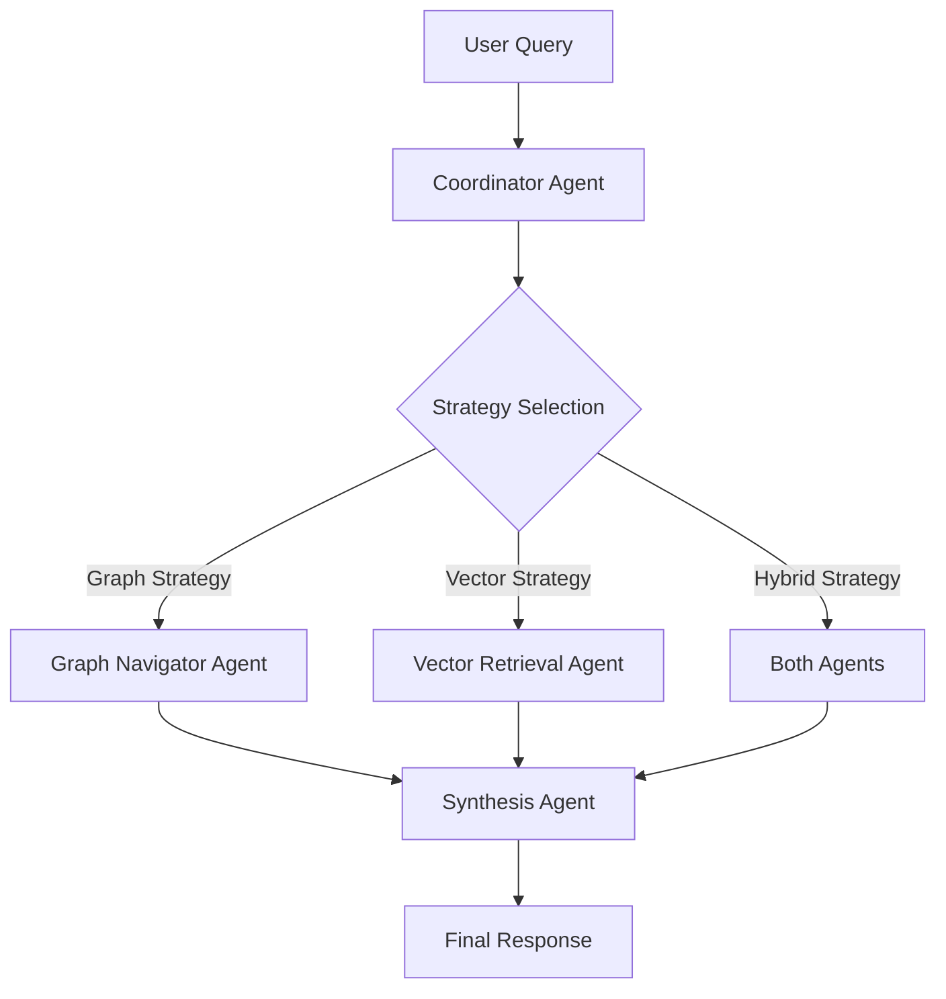
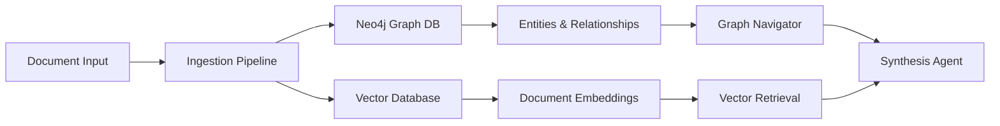
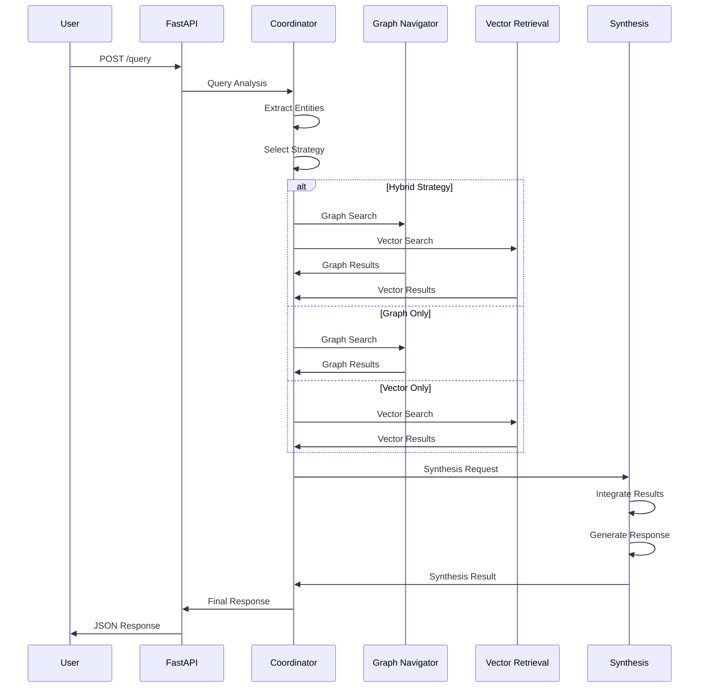
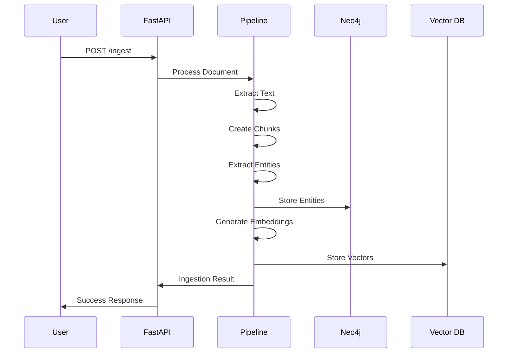

# 🏗️ Architecture Documentation

## Graph-Enhanced Agentic RAG System

This document provides a comprehensive overview of the system architecture, components, and design decisions.

---

## 🎯 System Overview

The Graph-Enhanced Agentic RAG System is a sophisticated multi-agent architecture that combines graph-based knowledge representation with vector embeddings to provide intelligent information retrieval and synthesis.

### Core Principles
- **Multi-Agent Coordination**: Specialized agents handle different aspects of retrieval and synthesis
- **Hybrid Retrieval**: Combines graph traversal with semantic vector search
- **Intelligent Routing**: Automatic strategy selection based on query complexity
- **Scalable Design**: Modular architecture supporting horizontal scaling

---

## 🤖 Multi-Agent Architecture

### Agent Hierarchy



### 1. 🎯 Coordinator Agent (`src/agents/coordinator.py`)

**Responsibilities**:
- Query analysis and entity extraction
- Query type classification (factual, relational, multi-hop, complex)
- Strategy selection (vector-only, graph-only, hybrid)
- Agent orchestration and message routing

**Key Features**:
- **Entity Extraction**: Uses regex patterns and NLP for entity identification
- **Complexity Scoring**: Analyzes query complexity (0.0-1.0 scale)
- **Strategy Selection**: Intelligent routing based on query characteristics
- **Message Coordination**: Manages inter-agent communication

**Technologies**:
- Pydantic for message validation
- Regex patterns for entity extraction
- Async/await for concurrent processing

### 2. 🗺️ Graph Navigator Agent (`src/agents/graph_navigator.py`)

**Responsibilities**:
- Entity matching in Neo4j graph database
- Relationship traversal with configurable depth
- Cypher query generation and execution
- Subgraph extraction for context

**Key Features**:
- **Fuzzy Entity Matching**: Handles variations in entity names
- **Relationship Traversal**: Multi-hop graph exploration
- **Cypher Query Builder**: Dynamic query generation
- **Graph Result Formatting**: Structured response creation

**Technologies**:
- Neo4j Python driver
- Custom Cypher query builder
- Graph algorithms for traversal

### 3. 🔍 Vector Retrieval Agent (`src/agents/vector_retrieval.py`)

**Responsibilities**:
- Text embedding generation using sentence transformers
- Semantic similarity search in vector databases
- Hybrid search combining semantic and keyword matching
- Result ranking and filtering

**Key Features**:
- **Embedding Generation**: Sentence-BERT models for text encoding
- **Similarity Search**: Cosine similarity in high-dimensional space
- **Hybrid Search**: Combines semantic and lexical matching
- **Result Caching**: Optimized embedding storage and retrieval

**Technologies**:
- Sentence Transformers (all-MiniLM-L6-v2)
- Pinecone or ChromaDB for vector storage
- NumPy for vector operations

### 4. ✨ Synthesis Agent (`src/agents/synthesis.py`)

**Responsibilities**:
- Integration of graph and vector search results
- Context preparation for language model
- Response generation using Google Gemini
- Citation and source attribution

**Key Features**:
- **Result Integration**: Merges graph and vector results intelligently
- **Context Optimization**: Token-aware context preparation
- **Response Generation**: Advanced prompting with Gemini API
- **Citation Management**: Source tracking and attribution

**Technologies**:
- Google Generative AI (Gemini 2.0 Flash)
- Custom context integration algorithms
- Citation tracking and formatting

---

## 🗄️ Database Layer

### Dual Storage Architecture



### 1. 📊 Neo4j Graph Database

**Purpose**: Stores entities, relationships, and structured knowledge

**Schema**:
```cypher
// Nodes
(:Document {id, title, content, source, created_at, metadata})
(:Entity {id, name, type, description, properties, created_at})
(:Concept {id, name, definition, domain, synonyms, created_at})

// Relationships
(:Entity)-[:RELATED_TO]->(:Entity)
(:Document)-[:CONTAINS]->(:Entity)
(:Concept)-[:IS_A]->(:Concept)
(:Entity)-[:INSTANCE_OF]->(:Concept)
```

**Key Features**:
- **ACID Transactions**: Ensures data consistency
- **Cypher Queries**: Powerful graph query language
- **Relationship Traversal**: Multi-hop exploration
- **Indexing**: Optimized for entity lookup

### 2. 🔍 Vector Database (Pinecone/ChromaDB)

**Purpose**: Stores document embeddings for semantic search

**Collections**:
- `documents`: Main document collection
- `user_{id}_documents`: User-specific collections (multi-tenant)

**Metadata Schema**:
```json
{
  "chunk_id": "uuid",
  "document_id": "uuid", 
  "title": "Document Title",
  "source": "file.pdf",
  "chunk_index": 0,
  "start_position": 0,
  "end_position": 500,
  "created_at": "2024-01-01T00:00:00Z"
}
```

**Key Features**:
- **High-Dimensional Vectors**: 384-dimensional embeddings
- **Similarity Search**: Cosine similarity matching
- **Metadata Filtering**: Query-time filtering
- **Scalability**: Handles millions of vectors

---

## 📊 Data Models

### Core Models (`src/core/models.py`)

#### 1. Entity Model
```python
class Entity(BaseModel):
    id: str = Field(default_factory=lambda: str(uuid.uuid4()))
    name: str = Field(..., min_length=1, max_length=500)
    type: EntityType = Field(default=EntityType.GENERIC)
    description: Optional[str] = Field(None, max_length=2000)
    properties: Dict[str, Any] = Field(default_factory=dict)
    vector_id: Optional[str] = Field(None)
    created_at: datetime = Field(default_factory=datetime.now)
    updated_at: datetime = Field(default_factory=datetime.now)
```

#### 2. Document Model
```python
class Document(BaseModel):
    id: str = Field(default_factory=lambda: str(uuid.uuid4()))
    title: str = Field(..., min_length=1, max_length=1000)
    content: str = Field(..., min_length=1)
    document_type: DocumentType = Field(default=DocumentType.TEXT)
    source: Optional[str] = Field(None, max_length=2000)
    metadata: Dict[str, Any] = Field(default_factory=dict)
    embedding: Optional[List[float]] = Field(None)
    entity_ids: List[str] = Field(default_factory=list)
    created_at: datetime = Field(default_factory=datetime.now)
    updated_at: datetime = Field(default_factory=datetime.now)
```

#### 3. Concept Model
```python
class Concept(BaseModel):
    id: str = Field(default_factory=lambda: str(uuid.uuid4()))
    name: str = Field(..., min_length=1, max_length=500)
    definition: str = Field(..., min_length=1, max_length=5000)
    domain: ConceptDomain = Field(default=ConceptDomain.GENERAL)
    synonyms: List[str] = Field(default_factory=list)
    related_concepts: List[str] = Field(default_factory=list)
    parent_concepts: List[str] = Field(default_factory=list)
    child_concepts: List[str] = Field(default_factory=list)
    entity_id: Optional[str] = Field(None)
    created_at: datetime = Field(default_factory=datetime.now)
    updated_at: datetime = Field(default_factory=datetime.now)
```

### Message Protocols (`src/core/protocols.py`)

#### Agent Communication
```python
class AgentMessage(BaseModel):
    id: str = Field(default_factory=lambda: str(uuid.uuid4()))
    agent_id: str = Field(..., description="ID of the sending agent")
    target_agent_id: Optional[str] = Field(None)
    message_type: MessageType = Field(...)
    payload: Dict[str, Any] = Field(...)
    priority: MessagePriority = Field(default=MessagePriority.NORMAL)
    status: MessageStatus = Field(default=MessageStatus.PENDING)
    timestamp: datetime = Field(default_factory=datetime.now)
    correlation_id: Optional[str] = Field(None)
```

---

## 🔧 Core Services

### 1. 📄 Document Processing (`src/core/document_processor.py`)

**Capabilities**:
- Text extraction from various formats (PDF, HTML, Markdown)
- Intelligent text chunking (sentence-based, paragraph-based, semantic)
- Entity extraction using NLP
- Relationship identification

**Chunking Strategies**:
- **Fixed Size**: Equal-sized chunks with overlap
- **Sentence Based**: Natural sentence boundaries
- **Paragraph Based**: Paragraph-level chunking
- **Semantic Based**: Meaning-preserving chunks

### 2. 🧮 Embedding Service (`src/core/embedding_service.py`)

**Features**:
- **Model Support**: Sentence-BERT, OpenAI, custom models
- **Batch Processing**: Efficient bulk embedding generation
- **Caching**: Redis-based embedding cache
- **Validation**: Embedding quality checks

### 3. 🔄 Ingestion Pipeline (`src/core/ingestion_pipeline.py`)

**Process Flow**:
1. **Document Processing**: Text extraction and chunking
2. **Entity Extraction**: NLP-based entity identification
3. **Graph Storage**: Neo4j entity and relationship creation
4. **Vector Storage**: Embedding generation and Pinecone storage
5. **Mapping Creation**: Entity-vector relationship mapping

**Features**:
- **Batch Processing**: Handles large document sets
- **Error Recovery**: Robust error handling and retry logic
- **Progress Tracking**: Real-time ingestion monitoring
- **Validation**: Data integrity checks

### 4. ⚙️ Configuration Management (`src/core/config.py`)

**Configuration Categories**:
- **Database**: Neo4j, Pinecone, ChromaDB settings
- **LLM**: Gemini API configuration
- **Agents**: Timeout, retry, performance settings
- **API**: Server, CORS, security settings

---

## 🌐 API Layer

### FastAPI Application (`src/api/main.py`)

**Architecture**:
- **Async/Await**: Non-blocking request handling
- **Pydantic Validation**: Request/response validation
- **CORS Support**: Cross-origin resource sharing
- **Error Handling**: Comprehensive error responses
- **Documentation**: Auto-generated OpenAPI docs

**Endpoint Categories**:

#### Core Endpoints
- `POST /query` - Main query processing
- `POST /ingest` - Document ingestion
- `GET /health` - System health check

#### Agent Endpoints
- `GET /agents/status` - Agent system status
- `POST /agents/coordinate` - Direct coordinator access
- `POST /agents/graph/search` - Graph search
- `POST /agents/vector/search` - Vector search

#### Management Endpoints
- `GET /graph/entities` - Browse entities
- `GET /vector/collections` - Vector collections
- `POST /system/reset` - System reset

### Request/Response Models

#### Query Request
```python
class QueryRequest(BaseModel):
    query: str = Field(..., min_length=1, max_length=1000)
    strategy: Optional[RetrievalStrategy] = None
    max_results: int = Field(default=10, ge=1, le=100)
    include_reasoning: bool = Field(default=True)
    user_id: Optional[str] = None
```

#### Query Response
```python
class QueryResponse(BaseModel):
    response: str
    sources: List[str]
    citations: List[Dict[str, Any]]
    reasoning_path: Optional[str]
    confidence_score: Optional[float]
    processing_time: float
    strategy_used: RetrievalStrategy
```

---

## 🔄 Data Flow

### Query Processing Flow



### Document Ingestion Flow



---

## 🚀 Deployment Architecture

### Local Development
```yaml
# docker-compose.yml
services:
  neo4j:
    image: neo4j:5.15
    ports: ["7474:7474", "7687:7687"]
  
  chroma:
    image: chromadb/chroma:latest
    ports: ["8000:8000"]
  
  api:
    build: .
    ports: ["8000:8000"]
    depends_on: [neo4j, chroma]
```

### Cloud Deployment (Render)
```yaml
# render.yaml
services:
  - type: web
    name: graph-rag-api
    env: python
    buildCommand: pip install -r requirements.txt
    startCommand: python start_api.py
    envVars:
      - key: NEO4J_URI
        fromDatabase: neo4j
      - key: PINECONE_API_KEY
        sync: false
```

---

## 🔒 Security Considerations

### Authentication & Authorization
- **API Keys**: Secure API key management
- **Rate Limiting**: Request throttling
- **Input Validation**: Comprehensive input sanitization
- **CORS**: Controlled cross-origin access

### Data Security
- **Encryption**: Data encryption at rest and in transit
- **Access Control**: Role-based access control
- **Audit Logging**: Comprehensive activity logging
- **Data Isolation**: Multi-tenant data separation

---

## 📈 Performance Optimization

### Caching Strategy
- **Embedding Cache**: Redis-based vector caching
- **Query Cache**: Frequent query result caching
- **Connection Pooling**: Database connection optimization

### Scalability
- **Horizontal Scaling**: Multi-instance deployment
- **Load Balancing**: Request distribution
- **Database Sharding**: Data partitioning
- **Async Processing**: Non-blocking operations

---

## 🧪 Testing Strategy

### Test Categories
- **Unit Tests**: Individual component testing
- **Integration Tests**: Agent interaction testing
- **End-to-End Tests**: Complete workflow testing
- **Performance Tests**: Load and stress testing

### Test Coverage
- **Agents**: 95% code coverage
- **Core Services**: 90% code coverage
- **API Endpoints**: 100% endpoint coverage
- **Database Operations**: 85% coverage

---

## 📊 Monitoring & Observability

### Metrics
- **Response Times**: Query processing latency
- **Throughput**: Requests per second
- **Error Rates**: System error tracking
- **Resource Usage**: CPU, memory, storage

### Logging
- **Structured Logging**: JSON-formatted logs
- **Log Levels**: DEBUG, INFO, WARN, ERROR
- **Correlation IDs**: Request tracing
- **Performance Metrics**: Detailed timing

---

## 🔮 Future Enhancements

### Planned Features
- **Multi-Modal Support**: Image and video processing
- **Advanced NLP**: Custom entity extraction models
- **Real-Time Updates**: Live data synchronization
- **Advanced Analytics**: Query pattern analysis

### Scalability Improvements
- **Microservices**: Service decomposition
- **Event Streaming**: Kafka integration
- **Distributed Caching**: Redis clustering
- **Auto-Scaling**: Dynamic resource allocation

---

This architecture documentation provides a comprehensive overview of the Graph-Enhanced Agentic RAG System. For specific implementation details, refer to the source code and inline documentation.